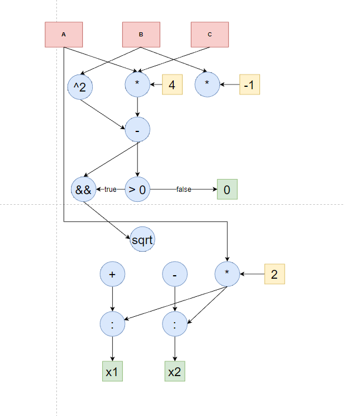
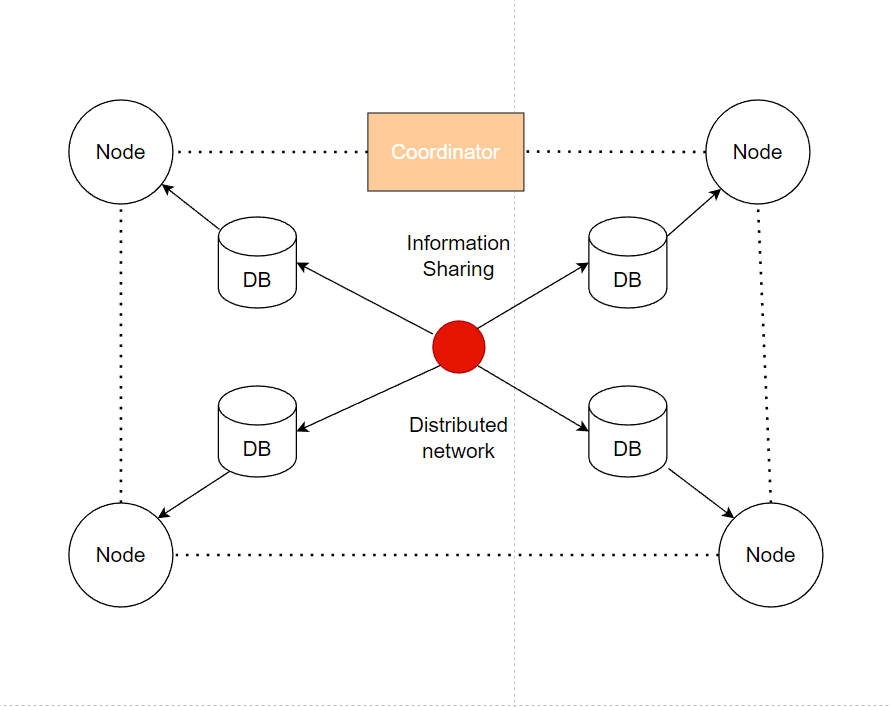

# Data Architecture

## 🔭 I'm currently working on Architecture Models on TypeScript

-   Architecture Models
-   OOP Paradigm
-   Data Flow Architecture
-   Data Centered Architecture
-   Hierarchical Architecture
-   Interaction Oriented Architecture
-   Distributed Architecture
-   Component Based Architecture
-   User Interface
-   Architecture Techniques

## 📐 Architecture Models

An architecture model is a partial abstraction of a system. It is an approximation, and it captures the different properties of the system. It is a scaled-down version and is built with all the essential details of the system. Architecture modeling involves identifying the characteristics of the system and expressing it as models so that the system can be understood. Architecture models allow visualization of information about the system represented by the model. The modeling process can be bottom up/inside out, by which details of the system are built utilizing knowledge about components and interconnections and how they compose together to realize the characteristics of the system. Alternatively, it can be top-down/outside in, by which details of the components and interconnections are extracted from knowledge of the whole. For the time study illustration, an architecture model is illustrated in Figure

## 🛸 OOP Paradigm

The major motivating factor in the invention of object-oriented approch is to remove some of the flaws encountered in the procedural approch. OOP treats data as a critical element in the program development and does not allow it to flow freely around the systems. It ties data more closely to the functions that operate on it, and protects it from accidental modification from outside functions. OOP allows decomposition of a problem into a number of entities called objects and then builds data and functions around these objects. The data of an object can be accessed only by the function associated with that object. However, functions of one object can access the the functions of other objects.

## ⌛ Data Flow Architecture

Dataflow programming (DFP) introduces a new programming paradigm that
internally represents applications as a directed graph, similarly to a dataflow
diagram. Applications are represented as a set of nodes (also called blocks) with
input and/or output ports in them. These nodes can either be sources, sinks or
processing blocks to the information flowing in the system. Nodes are connected
by directed edges that define the flow of information between them. Most visual
programming languages that use a block-based architecture for representing their
workflow are indeed based on DFP .Several advantages are inherited with such
model, as presented in this paper.

## 🏬 Data Centered Architecture

An information focused architecture, the information is concentrated and gotten to every now and again by different parts, which alter information. The fundamental motivation behind this style is to accomplish integrality of information. Information focused architecture comprises of various parts that convey through shared information vaults. The segments get to a common information structure and are generally free, in that, they associate just through the information store.
 
 
The most surely understood cases of the information focused design is a database architecture, in which the regular database construction is made with information definition convention – for instance, an arrangement of related tables with fields and information types in a RDBMS.
Another case of information focused structures is the web architecture which has a typical information composition (i.e. meta-structure of the Web) and takes after hypermedia information model and procedures impart using shared online information administrations.

## 🔥 Hierarchical Architecture

Hierarchical Architecture is a structural design pattern that divides business logic or huge class into separate class hierarchies that can be developed independently.
 
 
One of these hierarchies (often called the Abstraction) will get a reference to an object of the second hierarchy (Implementation). The abstraction will be able to delegate some (sometimes, most) of its calls to the implementations object. Since all implementations will have a common interface, they’d be interchangeable inside the abstraction.

## 💀 Interaction Oriented Architecture

The primary objective of interaction-oriented architecture is to separate the interaction of user from data abstraction and business data processing. The interaction-oriented software architecture decomposes the system into three major partitions −
 
 
Data module − Data module provides the data abstraction and all business logic.
 
 
Control module − Control module identifies the flow of control and system configuration actions.
 
 
View presentation module − View presentation module is responsible for visual or audio presentation of data output and it also provides an interface for user input.
 
 
Interaction-oriented architecture has two major styles − Model-View-Controller (MVC) and Presentation-Abstraction-Control (PAC). Both MVC and PAC propose three components decomposition and are used for interactive applications such as web applications with multiple talks and user interactions. They are different in their flow of control and organization. PAC is an agent-based hierarchical architecture but MVC does not have a clear hierarchical structure.

## ✒️ Distributed Architecture

In a distributed architecture , there is no need for a central authority. In this system architecture, each node is connected and coordinated with every node. They can collectively share the information and worked together. In this, if any single or multiple nodes fails then other nodes can share their information or perform the operation using coordination and cooperation.
 
 
So, from the aforementioned facts it is clear that, blockchain is a platform which helps us to provide a decentralized and distributed platform where we can share the information among others in a trusty manner. Using this technology, both Bob and Alice can edit or update the document simultaneously. The main advantage of this technology is that it does not rely on the centralized system. So, by definition, we can say that blockchain is a platform that provides consistency in the database. It also supports whatever information Alice and Bob are writing individually on the document, they get synchronized over the network.

## 🅰️ Component Based Architecture (Angular as Example)

The architecture of an Angular application relies on certain fundamental concepts. The basic building blocks of the Angular framework are Angular components that are organized into NgModules. NgModules collect related code into functional sets; an Angular application is defined by a set of NgModules. An application always has at least a root module that enables bootstrapping, and typically has many more feature modules.
 
 
Components define views, which are sets of screen elements that Angular can choose among and modify according to your program logic and data
 
 
Components use services, which provide specific functionality not directly related to views. Service providers can be injected into components as dependencies, making your code modular, reusable, and efficient.
 
 
Modules, components and services are classes that use decorators. These decorators mark their type and provide metadata that tells Angular how to use them.
 
 
The metadata for a component class associates it with a template that defines a view. A template combines ordinary HTML with Angular directives and binding markup that allow Angular to modify the HTML before rendering it for display.
 
 
The metadata for a service class provides the information Angular needs to make it available to components through dependency injection (DI)
 
 
An application's components typically define many views, arranged hierarchically. Angular provides the Router service to help you define navigation paths among views. The router provides sophisticated in-browser navigational capabilities.

## 👤 User Interface

User Interface (UI) Design focuses on anticipating what users might need to do and ensuring that the interface has elements that are easy to access, understand, and use to facilitate those actions. UI brings together concepts from interaction design, visual design, and information architecture.
 
 
Input Controls: buttons, text fields, checkboxes, radio buttons, dropdown lists, list boxes, toggles, date field
 
 
Navigational Components: breadcrumb, slider, search field, pagination, slider, tags, icons
 
 
Informational Components: tooltips, icons, progress bar, notifications, message boxes, modal windows

## ✨ Architecture Techniques

There are two things required for every architectural project: a site, and a program. Architectural programming is part of the pre-design phase for buildings, which involves research and decision-making to help the architect and client establish criteria for the basis of a building's design. 
 
 
This is time-intensive process, but programming in architecture is extremely important to create a framework for the entire project. Sometimes, the client may hire an architect for the programming phase and service the rest of the design work to another architect entirely. Creating an architectural program is ultimately about creating a ‘playbook’ for an architectural design.

### Why is Programming in Architecture so Important?

Every move considered at this stage has a potential to manifest within the final product. The architectural program will be the “playbook” for the design, and the designer must attempt to coalesce the technical aspects, as well as the experiential qualities of space to create a base point of reference for the entire project.
 
 
As the designer works closely with the client, important variables must be considered to ensure that the clients needs are met. Some of these variables may include, but are not limited:

* Who will the building ultimately serve?
* What program elements will the building contain?
* Where will these program elements be located?
* How will the building integrate within the site?
* What is the total size of the building?

Beyond the technical scope of programming, the designer must also consider experiential qualities, such as:

* What type of light will illuminate the space?
* How will the space deal with sound?
* What kind of materials will be used within the space?
* Which programmatic elements will be adjacent to one another?

### 🤝 Connect with me:

